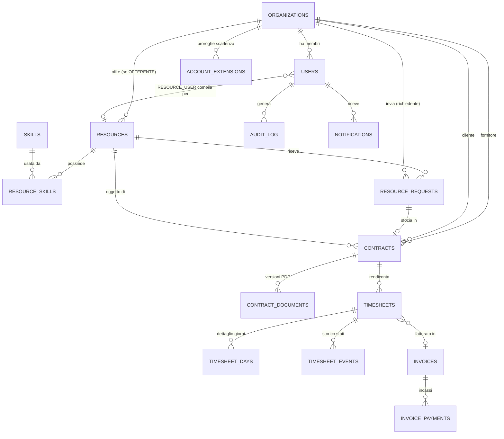

# 04 — Database Schema

PostgreSQL 16 (Supabase-ready). Il DDL eseguibile è in [`../db/schema.sql`](../db/schema.sql).

## 1. Diagramma ER



## 2. Le quattro entità richieste e la loro catena

```
ORGANIZATIONS ──┬── (OFFERENTE) ──► RESOURCES ──┐
                │                                │
                └── (RICHIEDENTE) ───────────────┴──► CONTRACTS ──► TIMESHEETS ──► INVOICES
                                                          │              │
                                                    tariffa         TIMESHEET_DAYS
                                                    concordata      (lun…dom)
```

Il **contratto è il perno**. Non si rendiconta "su una risorsa" né "su un cliente": si rendiconta su
un contratto, che porta con sé fornitore, cliente, risorsa, periodo di validità e — soprattutto — la
**tariffa concordata**. È la sorgente di verità per il calcolo degli importi: il range di costo sul
profilo resta indicativo e può cambiare nel tempo senza intaccare i rendiconti già emessi.

## 3. Tabelle principali

### 3.1 Identità e accessi

**`organizations`** — l'entità contrattuale.

| Colonna | Tipo | Note |
|---|---|---|
| `id` | `uuid` PK | |
| `type` | `org_type` | `OFFERENTE` \| `RICHIEDENTE` |
| `legal_name`, `vat_number`, `country` | text | `vat_number` unico |
| `status` | `org_status` | `PENDING_APPROVAL` `ACTIVE` `GRACE` `EXPIRED` `SUSPENDED` |
| **`access_expires_at`** | `date` | **Durata del profilo — impostata a mano dall'Admin** |
| `grace_ends_at` | `date` | calcolata: `access_expires_at + 15 gg` |
| `external_contract_ref` | text | riferimento al contratto cartaceo |
| `approved_by`, `approved_at` | | chi ha attivato l'account |

**`account_extensions`** — storico delle proroghe (chi, quando, da quale data a quale, con nota).
Senza questa tabella, "perché questo account scade a giugno?" diventa una domanda senza risposta.

**`users`** — chi fa login. `platform_role` ∈ {`OFFERENTE`, `RICHIEDENTE`, `RESOURCE_USER`,
`ADMIN`}, `org_role` ∈ {`OWNER`, `MEMBER`}. Un `RESOURCE_USER` ha `resource_id` valorizzato: vede
solo il time-sheet delle proprie giornate.

### 3.2 Catalogo

**`skills`** — tassonomia controllata: `category` ∈ {`HARD`, `SOFT`}, `parent_id` per raggruppare
(es. *Frontend* → *React*), `aliases text[]` per i sinonimi in ricerca ("JS" → "JavaScript").
Tassonomia chiusa, alimentata dall'Admin: le skill libere producono 40 varianti di "React" e
distruggono i filtri.

**`resources`** — il profilo tecnico.

| Colonna | Tipo | Note |
|---|---|---|
| `organization_id` | FK | il proprietario |
| `title` | text | "Senior React Developer" |
| `seniority` | enum | `JUNIOR` `MID` `SENIOR` `TECH_LEAD` |
| `availability` | enum | `IMMEDIATA` `ENTRO_1_MESE` `ENTRO_3_MESI` |
| `engagement` | enum | `PART_TIME` `FULL_TIME` |
| `rate_min`, `rate_max` | `numeric(10,2)` | range indicativo |
| `rate_unit` | enum | `DAILY` \| `HOURLY` |
| **`daily_rate_min_norm`** | **colonna generata** | `rate_unit='HOURLY' ? rate_min*8 : rate_min` — rende lo slider budget confrontabile |
| `work_mode` | enum | `ONSITE` `REMOTO` `IBRIDO` |
| `city`, `province`, `country`, `lat`, `lng` | | **obbligatorie se `work_mode <> 'REMOTO'`** (CHECK constraint) |
| `operational_status` | enum | `ATTIVA` \| `OCCUPATA` |
| `publication_status` | enum | `DRAFT` `IN_REVIEW` `PUBLISHED` `REJECTED` `ARCHIVED` |
| `skill_ids` | `uuid[]` | denormalizzato, indice **GIN** → filtro multi-skill in una condizione |
| `search_vector` | `tsvector` generato | full-text su titolo e descrizione |

Due assi separati, `publication_status` e `operational_status`, per la ragione spiegata in
[`01`](01-requisiti-e-ruoli.md#risorsa): un profilo che si libera non deve tornare in moderazione.

**`resource_skills`** — join con `level` (1–5) e `years`. L'array `skill_ids` è la copia
denormalizzata per la ricerca, mantenuta allineata da trigger: si accetta la ridondanza perché
trasforma 5 join in un `@>`.

**`resource_requests`** — la richiesta "Richiedi risorsa": brief del progetto, durata, budget, data
inizio, stato (`REQUESTED` `ACCEPTED` `DECLINED` `IN_NEGOTIATION` `CONTRACTED` `EXPIRED` `CLOSED`).

### 3.3 Contratti

**`contracts`**

| Colonna | Tipo | Note |
|---|---|---|
| `code` | text unique | es. `CTR-2026-0041` |
| `provider_org_id`, `client_org_id` | FK | fornitore e cliente; `CHECK` che siano diversi |
| `resource_id` | FK | la risorsa oggetto del contratto |
| `request_id` | FK nullable | la richiesta da cui nasce |
| `status` | enum | `DRAFT` `ACTIVE` `SUSPENDED` `EXPIRED` `TERMINATED` |
| **`agreed_rate`** | `numeric(10,2)` | **tariffa concordata: base di ogni calcolo** |
| `rate_unit` | enum | `DAILY` \| `HOURLY` |
| `start_date`, `end_date` | date | `CHECK (end_date >= start_date)` |
| `timesheet_required` | bool | disattivabile per contratti a corpo |
| `auto_approve_after_days` | int nullable | auto-approvazione opzionale, **off di default** |
| `visibility` | enum | `PRIVATO_OFFERENTE` `PRIVATO_RICHIEDENTE` `CONDIVISO` `SOLO_ADMIN` |

**`contract_documents`** — i PDF, **versionati**: `version`, `storage_key`, `file_hash` (SHA-256, per
provare che il file non è cambiato), `uploaded_by`, `signed_at`. La v2 non sovrascrive la v1.

### 3.4 Rendicontazione settimanale — il cuore

**`timesheets`** — una riga per **settimana ISO × contratto**.

| Colonna | Tipo | Note |
|---|---|---|
| `contract_id` | FK | |
| `iso_year`, `iso_week` | int | **`UNIQUE (contract_id, iso_year, iso_week)`** |
| `week_start`, `week_end` | date | lunedì/domenica, ridondanti ma comodissime per i filtri |
| `status` | enum | `DRAFT` `SUBMITTED` `APPROVED` `REJECTED` `INVOICED` `PAID` |
| `unit` | enum | copiata dal contratto al momento della creazione |
| `total_quantity` | `numeric(6,2)` | **ricalcolata da trigger** sui giorni, mai scritta dal client |
| `rate_snapshot` | `numeric(10,2)` | **la tariffa congelata al momento dell'approvazione** |
| `amount` | `numeric(12,2)` | `total_quantity × rate_snapshot`, calcolata dal server |
| `submitted_by/at`, `reviewed_by/at` | | chi ha inviato e chi ha approvato |
| `rejection_reason` | text | obbligatorio se `status = REJECTED` (CHECK) |
| `invoice_id` | FK nullable | la fattura che lo include |

Tre scelte da non saltare:

1. **`UNIQUE (contract_id, iso_year, iso_week)`** — rende fisicamente impossibile il doppio
   rendiconto della stessa settimana. È il vincolo che WordPress non può dare (vedi
   [`02`](02-fattibilita-wordpress.md#5-i-quattro-limiti-specifici-della-rendicontazione-su-wordpress))
   ed è ciò che protegge dalla doppia fatturazione su rete mobile instabile.
2. **`rate_snapshot`** — la tariffa viene copiata sul time-sheet all'approvazione. Se il contratto
   viene rinegoziato a marzo, le settimane di febbraio già approvate mantengono l'importo con cui
   sono state approvate. Senza snapshot, una rinegoziazione riscrive retroattivamente il passato.
3. **`total_quantity` e `amount` calcolati solo lato server**, da trigger e dalla tariffa del
   contratto. Il client invia le quantità giornaliere, mai i totali: altrimenti chiunque può inviare
   un importo arbitrario dal DevTools.

**`timesheet_days`** — il dettaglio giornaliero.

| Colonna | Tipo | Note |
|---|---|---|
| `timesheet_id` | FK on delete cascade | |
| `work_date` | date | **`UNIQUE (timesheet_id, work_date)`** |
| `day_type` | enum | `LAVORO` `TRASFERTA` `FERIE` `PERMESSO` `MALATTIA` `FESTIVO` `NON_LAVORATO` |
| `quantity` | `numeric(4,2)` | giorni (0 / 0,5 / 1) oppure ore (0–24), `CHECK (quantity between 0 and 24)` |
| `note` | text | facoltativa, per la trasferta o l'attività svolta |

Il dettaglio giornaliero e non il solo totale settimanale, perché è ciò che rende il rendiconto
verificabile dal cliente — ed è la ragione per cui approva senza telefonare.

**`timesheet_events`** — log append-only di ogni transizione (`from_status`, `to_status`, `actor`,
`reason`, `at`). Serve a rispondere a "chi ha approvato questa settimana e quando", che è la prima
domanda quando una fattura viene contestata.

**`public_holidays`** — festività italiane per anno, per precompilare la griglia e non far
rendicontare il 15 agosto per distrazione.

### 3.5 Fatture e pagamenti

**`invoices`** — nessun gateway, tutto manuale.

| Colonna | Note |
|---|---|
| `number`, `issue_date`, `due_date` | numero della fattura reale, emessa fuori dal sistema |
| `provider_org_id`, `client_org_id`, `contract_id` | |
| `period_start`, `period_end` | tipicamente il mese |
| `amount_net`, `vat_rate`, `amount_total` | precalcolati dal riepilogo, correggibili a mano |
| `payment_status` | `DA_EMETTERE` `EMESSA` `INVIATA` `PAGATA` `SCADUTA` `CONTESTATA` |
| `storage_key` | il PDF caricato |
| `paid_at`, `paid_amount` | aggiornati a mano |

**`invoice_payments`** — gli incassi, perché i pagamenti parziali esistono e un solo campo `paid_at`
non li rappresenta.

Il collegamento fattura ↔ time-sheet passa da `timesheets.invoice_id`: una fattura raggruppa più
settimane, una settimana appartiene al massimo a una fattura. Un `UNIQUE` parziale impedisce di
fatturare due volte la stessa settimana.

### 3.6 Trasversali

`audit_log` (append-only: attore, azione, entità, diff JSONB, IP, timestamp), `notifications`
(canale, stato di lettura, payload), `saved_searches` (filtri JSONB + flag alert),
`attachments` per i file generici.

## 4. Indici e query critiche

```sql
-- Ricerca faccettata del Richiedente
create index on resources using gin (skill_ids);
create index on resources using gin (search_vector);
create index on resources (publication_status, operational_status, seniority, work_mode);
create index on resources (daily_rate_min_norm, daily_rate_max_norm);

-- "Settimane da approvare" (badge del Richiedente): l'indice parziale è minuscolo e velocissimo
create index on timesheets (status, week_start) where status = 'SUBMITTED';

-- "Settimane da compilare" (Offerente) e monitor Admin
create index on timesheets (contract_id, iso_year desc, iso_week desc);

-- Scadenze account per il job notturno
create index on organizations (access_expires_at) where status in ('ACTIVE','GRACE');

-- Scaduto per cliente
create index on invoices (client_org_id, payment_status, due_date);
```

Query tipo — riepilogo di fatturazione di un mese:

```sql
select c.id, c.code, o.legal_name, r.title,
       sum(t.total_quantity)                as quantita,
       c.rate_unit, c.agreed_rate,
       sum(t.total_quantity * t.rate_snapshot) as imponibile
from timesheets t
  join contracts c on c.id = t.contract_id
  join organizations o on o.id = c.client_org_id
  join resources r on r.id = c.resource_id
where t.status = 'APPROVED'
  and t.week_start >= $1 and t.week_end <= $2
  and c.provider_org_id = $3
group by c.id, o.legal_name, r.title;
```

## 5. Row Level Security (Supabase)

RLS **attiva su tutte le tabelle**. Le policy chiave:

| Tabella | Regola |
|---|---|
| `resources` | l'offerente vede/modifica solo `organization_id = auth_org_id()`; il richiedente legge solo `publication_status='PUBLISHED'` e solo le colonne non anonimizzate (via vista `resources_public`) |
| `contracts` | leggibile se `provider_org_id` o `client_org_id` = la propria org, nel rispetto di `visibility` |
| `timesheets` | scrittura al fornitore solo se `status='DRAFT'`; `UPDATE` di approvazione al cliente solo se `status='SUBMITTED'`; lettura a entrambe le parti sempre |
| `timesheet_days` | scrivibile solo se il time-sheet padre è in `DRAFT` |
| `invoices` | leggibile dalle due parti; `payment_status` scrivibile **solo dall'Admin** |
| `audit_log` | inserimento da funzioni `security definer`, lettura solo Admin, nessun `UPDATE`/`DELETE` |

Più i due trigger di integrità: `prevent_approved_timesheet_edit()` (immutabilità del dato
approvato) e `recalc_timesheet_totals()` (totali sempre coerenti con i giorni).

## 6. Convenzioni

- Chiavi primarie `uuid` (`gen_random_uuid()`): non rivelano i volumi e non collidono in sync offline
  — il client può generare l'id della bozza prima di avere rete.
- `created_at`/`updated_at` `timestamptz` su ogni tabella, `updated_at` da trigger.
- Soft delete (`deleted_at`) su `resources` e `contracts`; **mai** su time-sheet e fatture, che sono
  documenti amministrativi.
- Importi `numeric`, mai `float`.
- Date di calendario in `date` (non `timestamptz`): il 3 marzo è il 3 marzo in qualunque fuso.
- Enum PostgreSQL per gli stati: il DB rifiuta un valore non previsto, cosa che una `varchar` non fa.
